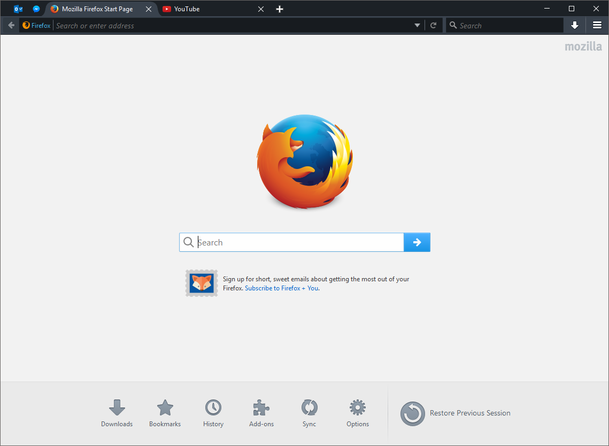
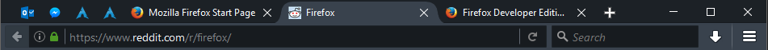

# Australis Dark Dev-Ed

The purpose of this project is to provide a Firefox Developer Edition theme with curved Australis tabs. Currently, it is implemented as a Stylish CSS theme.

 
 
 
 

## Installation Instructions
1. This theme requires Firefox Developer Edition dark theme to be installed and enabled.  
If you are using Firefox Stable release, install this addon: https://addons.mozilla.org/en-US/firefox/addon/devedition-theme-enabler/  
Note that if you are using Firefox Nightly (aka Developer Edition) you just have to ensure that you have the dark theme enabled.

1. Then enable the Developer Edition theme under Menu -> Add-ons -> Appearance.

1. You also have to install the Stylish addon from here: https://addons.mozilla.org/en-US/firefox/addon/stylish/

1. Then enable this theme in Stylish by installing this theme from here: https://userstyles.org/styles/127404/firefox-australis-dark-dev-ed

## Project Overview 
There are 2 files in this project: `from-default.css` and `from-dev.css`

`from-default.css` is the original implementation and should be deprecated soon. It transforms the default Firefox theme to Australis Dark.
`from-dev.css` transforms the Dev Edition theme to Australis Dark.

Transforming from Dev Edition is better because we get the platform-specific css for free.

We achieve a colored curved tabs by overriding the default PNG/SVG files and create our own files with the appropriate color, and append it in the CSS using data URI.

## Known and Possible Issues
1. The tab stroke looks a little weird on Linux (Tested on GNOME, GTK3)
1. Tab curves may be not perfect on Retina screens. Would be great if someone could test it.
1. Not tested on OSX. Would be great if someone could test it.